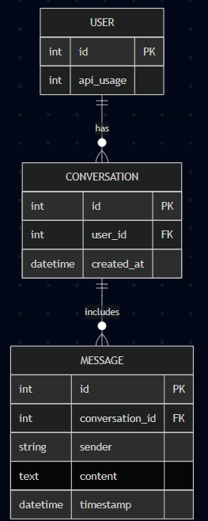

# 🚀 GenesisX Chatbot Core


## 🔥 Descripción
Desarrollo de una webapp para prueba técnica, el cual es chatbot interactivo usando Flask y Tailwind CSS, integrando la API de Anthropic (Claude 3 Haiku), con gestión completa de historial y límite de conversaciones.

## 🎯 Objetivos
- Validar arquitectura full-stack con énfasis en backend.
- Demostrar buenas prácticas en diseño de BD y manejo de variables sensibles.
- Mostrar capacidad de documentación clara y honesta de decisiones de diseño.

## 💡 Características Principales
- Chat en tiempo real con LLM externo (Anthropic).
- Límite estricto de **10 conversaciones** por usuario.
- Historial completo de conversaciones de cada usuario.
- Endpoints REST: `/chat`, `/history/<user_id>`, `/conversation/<conversation_id>` y `api_usage` (Bonus✅).
- Persistencia en SQLite usando SQLAlchemy.
- Contador de llamadas a la API para uso responsable.
- Integración Cursor Rules para calidad de código (Bonus✅).

## 🛠️ Tech Stack
| Componente   | Tecnología                   |
| ------------ | ---------------------------- |
| Backend      | Flask, Python 3.10+          |
| ORM          | SQLAlchemy                   |
| BD Local     | SQLite                       |
| Frontend     | HTML5, Tailwind CSS, Vanilla JS |
| LLM API      | Anthropic Claude 3 Haiku     |
| Entorno      | python-dotenv, .env.example  |
| Editor       | Cursor + Rules  |


## 📱Decisiones de Diseño Clave

**Inspiración Visual:** Para definir el estilo visual de la interfaz, exploré referencias en [Dribbble](https://dribbble.com/) buscando inspiración en interfaces de chatbot modernas. Analicé distintos patrones UI/UX utilizados en aplicaciones conversacionales actuales, priorizando aquellas que ofrecieran una experiencia clara, limpia y moderna.

**Elección Estética:** Me decidí por un diseño **moderno y minimalista**, con foco en la legibilidad y simplicidad. La interfaz presenta una estructura intuitiva que guía al usuario sin distracciones innecesarias, ideal para un producto centrado en interacción textual.

**Uso de Gradientes:** Para darle un toque distintivo y alineado con la identidad de GenesisX, utilicé un **gradiente personalizado** como fondo y en elementos clave de la UI. Este gradiente es el mismo que se usa en el logotipo de GenesisX, lo que refuerza la coherencia visual entre marca y producto.


**Responsive y Accesible:** La interfaz está pensada para adaptarse a diferentes tamaños de pantalla. Los colores y contrastes también fueron elegidos con criterios de accesibilidad en mente.

Estas decisiones no solo mejoran la estética, sino también la usabilidad del chatbot, generando una experiencia envolvente y alineada con los estándares actuales del diseño digital.


## 📐 Arquitectura



Descripción de las tablas:

- User: representa a cada usuario. Puede tener hasta 10 conversaciones.

- Conversation: agrupa los mensajes de un chat. Cada conversación pertenece a un usuario.

- Message: cada mensaje individual enviado por el usuario o el bot. Se relaciona con una conversación.


## 🗂️ Esquema de Base de Datos
```sql
-- Usuarios\CREATE TABLE users (
  id INTEGER PRIMARY KEY,
  username TEXT UNIQUE NOT NULL
);

-- Conversaciones\CREATE TABLE conversations (
  id INTEGER PRIMARY KEY,
  user_id INTEGER NOT NULL,
  start_time DATETIME DEFAULT CURRENT_TIMESTAMP,
  FOREIGN KEY(user_id) REFERENCES users(id)
);

-- Mensajes\CREATE TABLE messages (
  id INTEGER PRIMARY KEY,
  conversation_id INTEGER NOT NULL,
  role TEXT CHECK(role IN ('user','assistant')) NOT NULL,
  content TEXT NOT NULL,
  timestamp DATETIME DEFAULT CURRENT_TIMESTAMP,
  FOREIGN KEY(conversation_id) REFERENCES conversations(id)
);
```

## ⚙️ Instalación
1. `git clone <repo-url>`
2. `cd genesisx-chatbot-core`
3. Crear y activar entorno:
   ```bash
   python -m venv venv
   source venv/bin/activate  # macOS/Linux
   venv\Scripts\activate   # Windows
   ```
4. `pip install -r requirements.txt`
5. Copiar `.env.example` a `.env` y completar variables.


## 🚀 Instrucciones para levantar el servidor

Este proyecto requiere **dos ventanas de terminal** funcionando simultáneamente: una para el frontend y otra para el backend. A continuación se detallan los pasos para cada una.

### 🖥️ Terminal 1: Frontend

1. Abrir una nueva terminal.
2. Posicionarse en el directorio del frontend:

   ``` cd frontend  ```

3. Iniciar el servidor local para el frontend:

   ``` python -m http.server 8000  ```

   Esto levantará el frontend en http://localhost:8000


### 🛠️ Terminal 2: Backend

1. Abrir otra terminal en paralelo.
2. Asegurarse de estar en la raíz del proyecto
3. Activar el entorno virtual (venv):

   - En Windows:

    ``` .\venv\Scripts\activate  ```

   - En Linux/Mac:

    ``` source venv/bin/activate  ```

4. Exportar variables de entorno y levantar el servidor de Flask:

   En Linux/Mac:
    ```bash
     export FLASK_APP=backend/main.py
     export FLASK_ENV=development
     flask run --port=5000
    ```

   En Windows (cmd/powershell):
    ```bash
     set FLASK_APP=backend/main.py
     set FLASK_ENV=development
     flask run --port=5000
     ```

---

Una vez hecho esto, el servidor estará listo. El frontend corre en el puerto 8000 y el backend en el 5000.


## 📚 Endpoints
| Método | Ruta                                  | Descripción                                    |
| ------ | ------------------------------------- | ---------------------------------------------- |
| POST   | `/chat`                               | Envía mensaje y recibe respuesta del bot      |
| GET    | `/history/<user_id>`                 | Lista de conversaciones de un usuario         |
| GET    | `/conversation/<conversation_id>`    | Mensajes de una conversación específica        |
| GET    | `api_usage                       `    | Trae el numero de requests realizadas en el desarrollo        |


## 🎉 Extras y Bonus
- 📊 Script portable en G Drive(enlace) 
- 🏷 Uso de Cursor Rules 
- 🔋Api usage contador

## 🤝 Contribuciones
¡Bienvenidas! Abre issues o PRs descriptivos. Sigue el estilo de código y las Cursor Rules.

